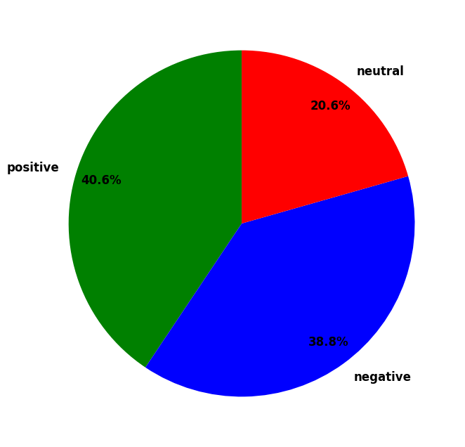
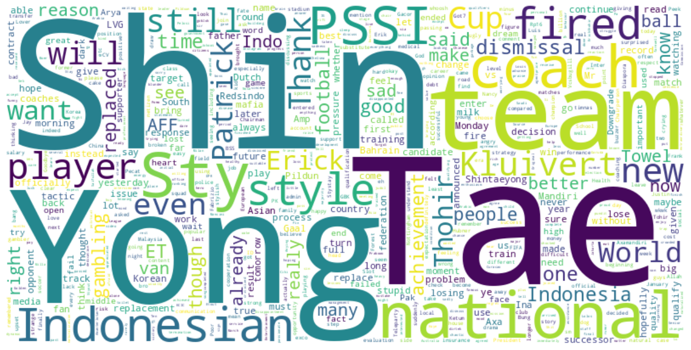

# Sentiment Analysis Project of Shin Tae-Yong Dismissal🎯

## Overview📚
This project was created based on the dismissal of Shin Tae Yong as head coach of the Indonesian national football team on Monday, January 6th 2025. This project aims to understand and assess public opinion sentiment on social media x. This project uses the Python Library TextBlob & Natural Language Toolkit, viz, NLTK Sentiment Vader SentimentIntensityAnalyzer.

## Methods🖥️
1. **Data Collection:** Tweet data is collected using the crawl method on social media x. The keywords used for the search were "STY" and "Shin Tae-yong" in the time period Monday, January 6th 2025 to Tuesday, January 7th 2025.
2. **Preprocessing:** The collected text is then combined and cleaned from noise such as URLs, usernames, punctuation, and changing text letters to lowercase. In this process, the text is also translated from Indonesian to English.
3. **Sentiment Analysis:** Sentiment analysis was performed using `TextBlob` and `NLTK VADER` libraries. Sentiment is classified into three categories: positive, negative, and neutral.
4. **Visualization:** The sentiment analysis results are visualized in the form of pie charts and word clouds.

## Installations🛠️
* `pandas`
* `re`
* `nltk`
* `textblob`
* `googletrans`
* `wordcloud`
* `matplotlib`

## Results📈
  
Based on the piechart, of the 884 opinions collected on social media x, the sentiment analysis results show that 40.6% (359 tweets) of opinions are positive, 38.8% (343 tweets) of opinions are negative, and 20.6% (182) of opinions are neutral. These results show that the change of coach or dismissal of Shin Tae-Yong gave a mixed response from the public as indicated by a small difference between positive and negative responses (not dominated by one sentiment). Positive sentiment is the sentiment with the most opinions obtained from the public's positive response in the form of thanks to Shin Tae-Yong for his services in bringing the national team to its current level. Negative sentiment is obtained from opinion which is dominated by expressions of public disappointment with the policies taken and rumors of new coaching.

   
Based on the word cloud, the words “Shin Tae Yong” and “Indonesia National Team” are the most dominant words that show great attention to Shin Tae-Yong's coaching of the Indonesian national team. Then, the words “Erick Tohir” and “PSSI” are also words that often appear in opinions. This shows that Erick Tohir as the chairman of PSSI and PSSI as the Indonesian football federation became the center of attention of the policy he took in making a coaching change. Furthermore, the word “World Cup” is also dominant in opinion which shows public attention to the policy of changing coaches made in the midst of world cup qualifications. In addition, the word “Patrick Kluivert” is also one of the most dominant which shows public attention to one of the names rumored to replace Shin Tae-Yong.

## Contributions🤝
Contributions and suggestions are greatly appreciated. Please submit a pull request if you would like to contribute to this project.
